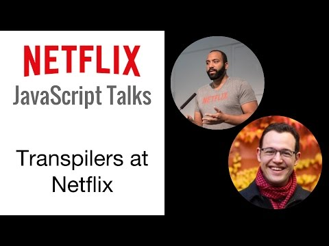

class: center, middle
# Progressive Transpiling
.footnote[Jul 2018]
---
# Agenda
* What is Progressive Transpiling?
* Why
* Impacts
* TODO:
???
Содержание: что такое Progressive Transpiling, зачем, какие-проблемы этом могут возникнуть.
---
# Original Video
The Road to ES2015 in Production
[](https://www.youtube.com/watch?v=M1qm-AWWu-M)  
[youtube.com/watch?v=M1qm-AWWu-M](https://www.youtube.com/watch?v=M1qm-AWWu-M)  
The Progressive Transpilation part (technical part) [starts at 25:25](https://youtu.be/M1qm-AWWu-M?t=1525)
???
Это не мое изобретение, а инженеров из Netflix.  
Оригинальное видео можно посмотреть тут, дата конец 2016-го, но информация до сих пор по большей частей актуальна.  
Там рассказывается об этом примерно час, я попробую рассказать минут за 30.
---
class: h1-condensed
# What is Progressive Transpiling?
1. Progressive - "Progressive" in Progressive Enhancement
2. Transpiling - Trans + Compile
???
Что это означает.
Первое слово - Progressive - имеет такое же значение, как и в слове Progressive Enhancement, т.е. что-то постепенное, пошаговое.  
Второе, Transpiling, это составное слово и состоит trans + compile, т.е. это перевод из одного исходного кода в другой.
---

???
Изначально когда появились первые транспайлеры, они создавались с целью перевода ES6 кода в ES5,
т.е., перевести современный код, который на тот момент не все могли исполнять, в старый, который понимали все браузеры.  
---
# There is Cost
* DX Cost
  - Outdated Devices
  - Transpiler Lock In
* UX Cost
  - Transpiled Code is Heavier - [example](https://agentcooper.github.io/typescript-play/?downlevelIteration=true&target=1#example/async-await)
  - Polyfills
???
Но у всего есть цена.  
С точки зрения разработчика плюсы очевидны, но есть и минусы.  
Изначально о шаге транспиляции, говорилось как о временном явлении, т.е. пока не все поддерживают современный javascript,
но как только все начнут поддерживать, мы этот шаг выкинем из билд процесса.  
Но тут выходят ES7, ES8, и в итоге оказалось, что мы не можем выкинуть шаг транспайлинга из нашего билд процесса,
потому что всегда найдется не успевает за технологиями.  
Еще одна проблема, что разные транспайлеры, производят разный код, по поведению он может быть одинаковый, но вот по быстродействию не всегда.  
(В оригинальном видео показывалось что какая-то функция от одного транспайлера выполняется в 2000 раз медленне чем от другого)

С точки зрения пользователя, транспилированный код по размеру занимает больше,
что означет большее время загрузки и больше времени на парсинг.  
В добавок, чтобы использовать новые структуры данных или функции, нужно подключать полифилы, которые, возможно, не всем и нужны.
---
class: h1-condensed
# What Netflix do .strike[today] 2016Q4
Netflix uses limited ES2015 features:
- const / let
- arrow functions
- template strings
- destructuring
- default parameters
???
Что мы можем сделать чтобы избавиться от стадии транспайлинга?  
Ну мы можем ограничить набор фич, скажем мы используем только ES6, ES7+ async / await не используем, и тогда рано или поздно мы от транспайлинга.
Из-за этих вышеперечисленных проблем, в netflix использовали (на тот момент, конец 2016) ограниченный набор фич.  
(Потому что они не производят раздутый код, и не сильно влияют на производительность)
---
# Goals
* Best experience for users
* Best experience for developers
???
Тут возникаем такая дилема, что
с одной пользоваться последними фичами языка, типа async/await с другой мы не хотим грузить пользователя лишним и медленным кодом.
---
# Things Changes
* Modern browsers can speak ES2015
* Not all browsers are modern browsers
???
С тех пор как появились первые транспайлеры, прошло много времени и многое изменилось.  
В netflix провели исследование и оказалось что около 70% их пользователей могут понимать ES6.  
С одной стороны хорошо, с другой стороны это плохо, потому что остальные 30% не понимают ES6, и мы не можем им сказать, ты смени браузер и потом приходи.
---
# Is It a Good Idea?
* 20-40% reduction of payload
* Less parse time
* Less complexity
* Debuggability better
???
Но сначала надо разобраться, а это вообще хорошая идея грузить пользователям ES6 код?  
Ответ, да. Размер будет меньше, что значит меньше время на загрузку, меньше времени на парсинг.
---
class: h1-condensed
# Browsers Has Varying Support
* Modern - Full support
* Trailing - Partial support
* Legacy - No support
???
Но степень поддержки в разных бразуерах и версиях - разная,
У нас может быть полная и частичная. И мы все эти браузеры должны поддерживать.
И как мы поступали, когда у нас была частичная подержка ES5 - добавляем полифилы,
но не все подряд, а то только те которые нужны чтобы запустить приложение.
И это best практика.
---
# Polyfills
Ship only what you need  

```
<script src="https://cdn.polyfill.io/v2/polyfill.min.js"></script>
```
???
Есть такой сервис polyfill.io, который делает такое.
Если подключить этот скрипт, он отправит клиенту набор полифилов, который необходим клиенту.
Это такая бест практика, отправлять клиенту только то что необходимо.

И с 2017-го, netflix использует в продакшн, нетранспиленный ES6 код, для современных браузеров.  
Для тех у кого не поддерживается ES6, будет загружаться транспилированный в ES5 с полифилами.
Как они это будут делать?
---
# Progressive Transpilation

* Modern - ES2015
* Trailing - Transpile to ES5, polyfill ES2015
* Legacy - Transpile to ES5, polyfill ES2015, polyfill ES5
???
Методом Progressive Transpilation!  
Для современных браузеров мы отдаем ES6 бандл.  
Для тех у кого частичная поддержка или никакой, ES5 бандл с полифилами.  
На этом пути у нас есть несколько проблем.
---
# Few Issues
1. Build system lack support
2. Minifiers
3. Targeting browser is hard
4. Browsers are broken and lie
???
Вернее на тот момент это проблемы. Сейчас они будут казаться не серьезными.  
---
class: h1-condensed
# Issue 1: Build System Support
* Closure Compiler `language_out` (no ES7)
* traceur (no ES6 support)
* CoffeeScript / Dart / Elm / PureScript (?)
???
Ваш транспайлер или язык может не поддерживать на выходе ES6, ES7.
В Closure Compiler до недавнего времени не было поддержки ES6 на выходе, т.е. на вход можно было давать ES6, а на выходе нет. ES6 был добавлен, но ES7 нет.
Трейсер нет поддержки ES6 на выходе.  
Поддержка в других языках тоже может не быть.
---
# Solution to Issue #1
Babel (Do not use ES2015 preset)
```js
const babelConfig = {
    modern: {
        presets: []
    },
    trailing: {
        presets: ['es2015']
    }
}
```
TypeScript (ES2015 supported as target)
```js
const tsConfig = {
    compilerOptions: {
        target: 'es6'
    }
}
```
???
Но у большинства проблем с этим не будет, потому что в большинстве случаев в качестве транспайлера используется babel или typescript,
а у них есть есть поддержка вывода не только в ES6, но и в следующие версии ES7 и выше.
И так мы собрали бандл, и он занимает сколько-то мегабайт.
---
# Issue 2: Minifiers
* Closure Compiler (no ES7)
* UglifyJS

People Working On
* babili, babel-minify (beta)
* uglify-es
* butternut (alpha)
???
Следующая проблема, которая похожа на 1-ую, ваш минификатор может не поддерживать ES6 на выходе.
У Closure Compiler, как я уже говорил, до недавнего времени не было поддержки ES6, ES7 нет.  
Но есть решения - babel minify, uglify-es - у них есть поддержка, появилась не так давно.
---
class: pre-wrap
# Issue 3: Targeting Browsers
User Agent - on first load, it's all we have.
```
Mozilla/5.0 (Windows NT 6.1; Win64; x64) AppleWebKit/537.36 (KHTML, like Gecko) Chrome/42.0.2311.135 Safari/537.36 Edge/12.10240
```
???
И так мы скомпилировали, сминифицировали, и кому мы это будем отправлять.  
Очевидно, что мы не должны отдавать этот бандл всем подряд.
И наша цель здесь отдать нужный бандл при 1-м запросе.
Все что у нас есть, User Agent строка - она отправляется в заголовках в каждом запросе.
Внизу это User Agent строка от Edge браузеров, и для парсеров и это информация как бы говорит парсеру, если ты не знаешь об edge,
может быть ты знаешь о Chrome, и веду себя как Chrome 42.
Но понятно, что Edge 12 и Chrome 42 это не одно и тоже.
---
class: h1-condensed, image80
# Select ES6 support browsers
https://kangax.github.io/compat-table/

???
Есть такая таблица kangax.github.io, в которой собрана информация о поддержке фич в разных браузерах.
---
# Browsers with ES6 support
Our ES6 browsers are:
```
var MinimumForES6 = {
    "Chrome": 51,
    "Edge": 14,
    "Firefox": 49,
    "Safari": 10
}

var useragent = require('useragent');

function supportsES6(headers) {
    var agent = useragent.lookup(headers['user-agent'])
    var requiredVersion = MinimumForES6[agent.family]
    if (requiredVersion) {
        return parseInt(agent.major) >= requiredVersion
    }
    return false
}
```
???
Из этой таблицы сопоставляем фичи, и находим нужные версии браузеров.
Если на сервере, из user agent строки, мы определяем ES6 поддерживается, мы отправляем клиенту ES6 бандл.
---
# Issue 4: Browsers can lie
.fs75[
Mozilla/5.0 (Windows NT 6.1; Win64; x64) AppleWebKit/537.36 (KHTML, like Gecko) Chrome/42.0.2311.135 Safari/537.36 Edge/12.10240
]
.center[

]
* New browser
* Browser plugin
* Other different reasons
???
4-ая проблема - браузеры могут нас обмануть, это может случиться по разным причинам: новый браузер или неизвестный браузер, плагин, еще что-нибудь.
Т.е. браузер может сказать нам что я кто-то другой.
---
class: pre-wrap
# Solution to Issue #4
Execute a bit of JavaScript and test for lies
???
Единственный способ проверить что бразуер нас не обманывает, это запустить в нем javascript и посмотреть правильно ли он сработал,
очевидно что но не любой, а определенный, который проверит поддержку ES6.
---
class: pre-wrap
# Test for lying
```js
class ಠ_ಠ extends Array {
    constructor(j = "a", ...c) {
        const q = (({ u: e }) => {
            return {
                [`s${c}`]: Symbol(j)
            };
        })({});
        super(j, q, ...c);
    }
}
new Promise((f) => {
    const a = function* () {
        return "\u{20BB7}".match(/./u)[0].length === 2 || true;
    };
    for (let vre of a()) {
        const [uw, as, he, re] = [new Set(), new WeakSet(), new Map(), new WeakMap()];
        break;
    }
    f(new Proxy({}, { get: (han, h) => h in han ? han[h] : "42".repeat(0o10) }));
}).then(bi => new ಠ_ಠ(bi.rd));
```
???
В этом куске кода, есть большинство ES6 фич.
---
# Test for lying
.column-count-2[
* arrows
* classes
* enhanced object literals
* template strings
* destructuring
* default + rest + spread
* let + const
* iterators + for..of
* generators
* unicode
* proxies
* symbols
* subclassable built-ins
* promises
* math + number + string APIs
* array + object APIs
* binary and octal literals
]

**This is NOT all ES6 features!**
???
Классы, генераторы, итераторы, прокси, rest параметры и т.д.
Но здесь не все фичи.
---
# Test for lying
```js
var es2015Test = 'class ಠ_ಠ extends Array ... ';

eval(es2015Test);
```
???
И мы должны сделать на нем eval(), да, потому что если вставим такой код с помощью тэга script, у нас все может упасть в рантайме и остальной код не выполнится.
eval() здесь относительно безопасен, потому что мы используем заранее известную строку и без переменных.
---
# Test for lying
```js
var es2015Test = 'class ಠ_ಠ extends Array ... ';

try {
    eval(es2015Test);
} catch (e) {

}
```
???
Этот eval надо обернуть в try catch, если что-то падаем в catch, и это означает что этот браузер не смог распарсить эту строку,
значит он не понимает ES6.
---
# Test for lying
```js
var es2015Test = 'class ಠ_ಠ extends Array ... ';

try {
    eval(es2015Test);
} catch (e) {
    document.cookie = 'esVersion=5; expires=' + (new Date((new Date()).getTime() + 2678400000)).toUTCString() + '; path=/';
    location.reload(true);
}
```
???
Далее мы устанавливаем куки на месяц, что этот браузер не понимает ES6.
Зачем это нужно, потому что браузер может обновляться и этот eval() не всегда может падать, но мы также не хотим чтобы этот eval()
выполнялся при каждом запросе.
И затем мы перезагружаем страницу, и когда запрос возвращается на сервер, сервер должен ответить браузеру, что то вроде, по user-agent строке видно
что ты можешь понимать ES6, но у тебя есть вот эта кука, и она знает лучше, поэтому получай ES5 бандл с полифилами.
---
# Recap
1. Parse the UA string and determine ES2015 eligibility
2. If ES2015 is indicated, ship a page with ES2015-level code.
3. Inject the 'ES2015 Syntax Check' script tag at the top of the page which will check to make sure the browser can parse ES2015 syntax and run some of the newer constructs.
4. If it turns out the browser's UA was a lie, and it can't actually parse or run ES2015, we set a cookie to limit future requests to ES5, and bounce the page as we know the incoming JS package won't work on this browser. Because the cookie is sticky, the interaction happens only once, and is only for corner cases where browsers are lying about their capabilities - a minority case already.
???
Итак, еще раз:
1. Парсим user agent строку и определяем поддержку es6
2. Если поддержка есть, вставляем ссылку на ES6 бандл
3. Вставляем кусок es6 и убеждаемся что он работает
4. Если не работает ставим куки и перезагружаем страницу
---
# Measurements
`angular-realworld-example-app>npx ng build --prod`

target: ES5 with polyfills es6 + es7/reflect
```sh
chunk {7} polyfills.74c949fb901fde2a61b1.js (polyfills) 98.3 KiB
chunk {8} main.865929fffa0b50ea010d.js (main) 384 KiB
```

target: ES6 with es7/reflect polyfills
```sh
chunk {7} polyfills.e4d1ecc894d812244204.js (polyfills) 59.6 KiB
chunk {8} main.96059b6da9777d026995.js (main) 340 KiB
```
Result: (384 + 98.3) - (340 + 59.6) = 82.7 KiB
???
Результаты. Нам говорили что размер должен уменьшится на 20% и более процентов.
На тестовом приложении angular-realworld-example получился выигрыш не многим более 15%.
Но какая здесь особенность, все сторонние библиотеки, angular, rxjs они как правило поставляются в формате es5 бандла (но с разными типами сборки umd, esm, etc.)
Может быть можно еще было выиграть в размере, если бы пересобрать все зависимости в es6, но я этим не стал заниматься.
---
# Other methods
```html
<script type="module"></script>
```
```js
var LEGACY = !this.Reflect;
```
???
В интернете встречаются еще способы определения возможности исполнять ES6.
Я встречал два - это script type module, проверка на глобальный Reflect.
---
# Impacts
1. `es2015Test` test string checks not all ES6 features
2. Solution above will not work with static server
3. More than one bundles in production
???
Какие проблемы у нас могут возникнуть:  
(23)[#23] 1. В тестовое строке мы определяли не все фичи, например здесь нет проверки на Object.assign, и если мы будем его использовать но не подставим в эту строку,
у нас ошибка в runtime (граничный случай), поэтому за этим надо следить либо как-то это автоматизировать (сбор фич используемых в коде).
2. Предложеное решение оно для динамического сервера, на статическом сервере тоже можно сделать, но чуть по другому, там придется динамически вставлять ссылку на нужный бандл,
что может быть не так производительно.
3. 3-ая проблема, у нас в продакшене, 2 разных бандла.
Если вы знакомы с таким явлением как дебаг в продакшене, то этот процесс может стать для вас более неприятным.
---
# Transpilation iff
```js
[...document.querySelectorAll('a')] // valid ES6
```
```js
// target ES5 - runtime error
document.querySelectorAll('a').slice();
```
`--downlevelIteration` [full example](https://agentcooper.github.io/typescript-play/?downlevelIteration=true&target=1#code/NoOjBMHsGMFcFsCmA7ALiAjrRAnAngMqIA2i0qkOAgscQBQDkAhgwJQC6QA)
```ts
// var __spread ~ 20 LOC
__spread(document.querySelectorAll('a'));
```
```ts
// can be ok in ES5 (even with disabled downlevelIteration)
publish(message: string, args?: any[]) {
    subscription.execute(null, ...args);
}
publish('hi'); // ES6 => TypeError: undefined is not iterable (strictNullChecks is the cure)
```
???
Почему это может быть проблемой.
1ая строка - это валидный es6, и при транспиляции в ES5 тайпскриптом получается ошибка, потому что querySelectorAll возвращает не массив,
а NodeList у которого нет метода slice().
Чтобы это пофиксить надо включить опцию downlevelIteration.
И возможна обратная ситуация, когда мы компилировались es5 ошибки не было, а переключились на ES6 ошибка появилась.
Последний пример кода. Чтобы пофиксить надо включить опцию strictNullChecks 
---
class: ul-condensed, ul-font-size-80-pct
# The End
* https://youtu.be/M1qm-AWWu-M?t=1525 - The Progressive Transpilation part
* https://speakerdeck.com/betaorbust/progressive-transpilation-at-netflix-and-the-road-to-running-native-es2015-in-production - Progressive Transpilation at Netflix (Slides)
* https://gist.github.com/betaorbust/fed8112f72005a3472d78967b8d121a2 - ES2015 Syntax Check for use with Progressive Transpilation
* https://github.com/Microsoft/TypeScript/issues/8122 - Support Progressive Transpilation
* https://medium.com/@kasajian/progressive-transpilation-def5da34282e - Progressive Transpilation
* https://philipwalton.com/articles/deploying-es2015-code-in-production-today/ - Deploying ES2015+ Code in Production Today
* https://medium.freecodecamp.org/you-might-not-need-to-transpile-your-javascript-4d5e0a438ca - You might not need to transpile your JavaScript
* https://gist.github.com/newyankeecodeshop/79f3e1348a09583faf62ed55b58d09d9 - Serving ES6 to modern browsers
* https://gist.github.com/newyankeecodeshop/94f0bb8b6a34d60c95f264ea3deed0c4 - Browser detection for ES6 support
* https://itnext.io/a-bloatless-web-d4f811c7991b - A Bloatless Web
* https://github.com/unlight/progressive-transpile-starter - Static server example
???
Вопросы:  
* Первое название babel?
---
???
# Draft
Research
В netflix провели исследование и оказалось что 70% могут понимать ES6 код.
???
Но тут появляется ES7, ES8. И кажется что шаг транспайлинга застрял навсегда.  
Нам как разработчикам, транспайлеры должны очень нравится, потому что мы имеем возможность писать современный код,
не задумываясь поддерживается ли эта фича у пользователя.

17 June 2015
На тот момент никто полностью не поддерживал es6
нужен был инструмент который позволял писать современный js
и конечно всем нам нравится новый синтаксис: стрелочный функции, деструктуризация
there is cost
UX
в чем она заключается
dx cost - изначально как только появились...
мы не можем выкинуть шаг транспайлинга из нашего билд процесса, потому что всегда найдется не успевает за технологиями 
и пользуется устаревшими
[картинка статистика браузер usage]
dx cost - transpiler lock in
разные транспайлеры генерирует разный код и разница в скорости может быть несколько порядков
ux cost
transpiled code is heavier
https://agentcooper.github.io/typescript-play/   using inheritance
он больше
polyfills
- what netflix do [s]today[/s] 2016Q4
netflix uses limited es2015 features
const / let
arrow functions
template strings
destructuring
default parameters
потому что для них не нужны полифилы, и они не сильно раздувают результирующий код 

Эта концепция будет использована в дальнейшем


var MinimumForES6 = {
    "Chrome": 49,
    "Edge": 14,
    "Firefox": 45,
    "Safari": 10
}
https://speakerdeck.com/betaorbust/progressive-transpilation-at-netflix-and-the-road-to-running-native-es2015-in-production?slide=54

webpack 3 commonjs target = es5
4.54 MB (4,765,719 bytes)
1.49 MB (1,567,278 bytes) minified

webpack 3 commonjs target = es6
4.48 MB (4,700,047 bytes)

webpack 4 mode = develpoment target es5 module commonjs
5.00 MB (5,247,130 bytes)
1.48 MB (1,560,052 bytes) minified

webpack 4 mode = develpoment target es5 module es2015
minified 1.42 MB (1,496,885 bytes)

webpack 4 mode = develpoment target es6 module commonjs (without es6 polyfills)
4.69 MB (4,927,200 bytes)
1.41 MB (1,487,188 bytes) minified 

webpack 4 mode = develpoment target es6 module es2015 (without es6 polyfills)
1.35 MB (1,425,178 bytes) minified

c:\Dev\ETM\etm.portal>npm run build:prod -- --env.aot=0 --env.es5 --env.esm=1 --env.mode=production


375 KiB (384,232 bytes)
332 KiB (339,982 bytes)
| x | x |
|:--|:--|
| x | x |